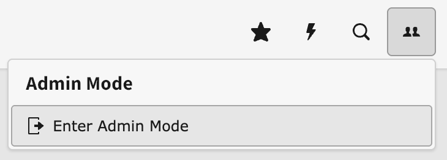

# Elevate to Admin

A TYPO3 extension that removes permanent admin access and lets users elevate to admin only when needed.

Admin users log in without admin privileges. Not only does this satisfy cyber security accreditations*, it allows your admin users to use the website as Editors which means they can quickly see any permissions or UI Bugs, issues and errors

## Features

- Meets Cyber Essentials and ISO 27001 requirements*
- See who is an admin and since when
- Resets privileges after 10 minutes of inactivity
- Clears admin privileges after logging out
- Allows admins to sill log in when backend is locked for editors

## Installation

1. `composer require liquidlight/typo3-elevate-to-admin`
2. Edit backend users and enable "Can elevate to admin" where appropriate (existing admins will have this enabled when they login )
3. Selected users can use the dropdown in the corner to elevate to admin



The user can exit admin mode by using the same dropdown.

## How It Works

1. **Login as regular user** - Admin users log in without admin privileges
2. **Work normally** - Browse, edit content, and perform regular tasks
3. **Elevate when needed** - Click the dropdown to become admin for specific tasks
4. **Auto-logout** - Admin privileges automatically expire after 10 minutes of inactivity

## Events

The extension dispatches PSR-14 events that allow you to customize the behaviour:

### BeforeAdminElevationProcessEvent

This event is dispatched before the admin elevation processing begins. You can use it to skip the elevation process entirely based on custom conditions.

#### Example: Make everyone admin in development mode

```php
<?php

namespace MyVendor\MyExtension\EventListener;

use LiquidLight\ElevateToAdmin\Event\BeforeAdminElevationProcessEvent;
use LiquidLight\ElevateToAdmin\Traits\AdminElevationTrait;
use TYPO3\CMS\Core\Core\Environment;

final class DevModeAdminListener
{
    use AdminElevationTrait;

    public function __invoke(BeforeAdminElevationProcessEvent $event): void
    {
        if (Environment::getContext()->isDevelopment()) {
            $user = $event->getBackendUser();

            // Make user admin if they can elevate and aren't already admin
            if ($this->canUserElevate($user) && !$user->isAdmin()) {
                $this->setAdminElevation((int)$user->user['uid']);
            }

            // Skip normal processing since we've handled it
            $event->skipProcessing();
        }
    }
}
```

Register the event listener in `Configuration/Services.yaml`:

```yaml
services:
  MyVendor\MyExtension\EventListener\DevModeAdminListener:
    tags:
      - name: event.listener
        identifier: 'dev-mode-admin'
        event: LiquidLight\ElevateToAdmin\Event\BeforeAdminElevationProcessEvent
```

## Testing

This extension includes comprehensive unit and functional tests with database integration.

### Unit Tests

Unit tests can be run with

```
composer i
composer test-unit
```

### Functional Tests

Unit tests can be run with

```
composer i
composer test-functional
```

---

## * Cybersecurity requirements

Please check to ensure elevation/re-authentication is acceptable for your require security practices and accreditations. After our research, we have found:

### Cyber Essentials

The official requirement states "use separate accounts to perform administrative activities only" - but this is **ambiguous**. It could mean:

- **Separate user accounts** (strict interpretation)
- **Separate administrative sessions/activities** (flexible interpretation allowing elevation)

**Problem:** Some certification bodies explicitly state that "account separation" is mandatory and that privilege elevation methods don't meet requirements, while others may accept properly implemented elevation.

**Recommendation:** Check with your specific certification body, as interpretations vary.

### ISO 27001:2022

**More flexible approach.** The updated standard "does not explicitly require a different user ID for privileged access" and "emphasises the need to re-authenticate prior to receiving privileged access rights."

Elevation with re-authentication **is acceptable** if it includes:
- Proper re-authentication before privilege escalation
- Session separation and logging
- Clear audit trails

### Bottom Line

- **Cyber Essentials:** Unclear - depends on your certification body's interpretation
- **ISO 27001:2022:** Elevation with proper controls is acceptable

### Sources

- **NCSC Cyber Essentials Requirements:** [Official Documentation v3.2](https://www.ncsc.gov.uk/files/cyber-essentials-requirements-for-it-infrastructure-v3-2.pdf)
- **ISO 27001:2022 Control 8.2:** [Implementation Guidance](https://www.isms.online/iso-27001/annex-a-2022/8-2-use-of-privileged-access-rights-2022/)
- **Cyber Essentials Overview:** [NCSC Website](https://www.ncsc.gov.uk/cyberessentials/overview)

---
*Always verify requirements with your certification body before implementation*
